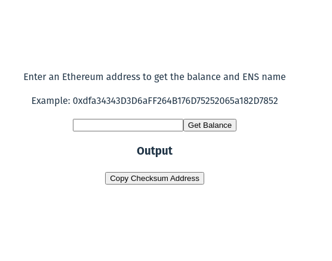

# 01-encode-smart-contract-calldata

```sh
cd 01-encode-smart-contract-calldata
npm install // or yarn
npx tsx encode-calldata.ts
```

# 02-eth-address-info-react-component
```sh
cd 02-eth-address-info-react-component/eth-address-info
npm install // or yarn
npm run dev
# navigate to localhost:5173
```
## screenshot


# 03-store-block-details
```sh
cd 03-store-block-details
npm install // or yarn
npx tsx listen-block.ts
```